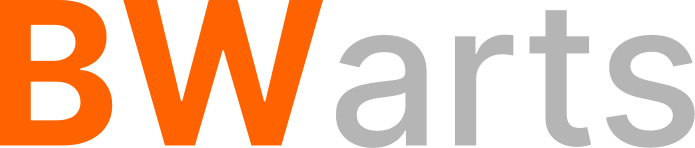

# BWartsMaker - E-commerce de Produtos em MDF

Este projeto, desenvolvido por alunos da Fatec Ferraz de Vasconcelos, tem como objetivo atender às necessidades de um microempreendedor que possui uma máquina de corte a laser para MDF e busca ampliar seu alcance no mercado e aumentar suas vendas.

A proposta consiste no desenvolvimento de uma plataforma digital de e-commerce voltada para a comercialização de produtos em MDF, oferecendo como diferencial um sistema de personalização. Por meio dessa plataforma, os clientes poderão adquirir produtos prontos, personalizar modelos existentes ou criar peças totalmente originais de acordo com suas preferências.

Dessa forma, o projeto agrega valor aos produtos oferecidos, melhora a experiência do cliente e fortalece a presença digital do empreendedor no mercado.

---

# Índice

- [Objetivo Específico](#objetivo-específico)
- [Funcionalidades](#funcionalidades)
- [Sobre os Integrantes](#sobre-os-integrantes)
- [Tecnologias utilizadas](#tecnologias-utilizadas-no-projeto)
- [Pré-requisitos](#pré-requisitos)

---

# Objetivo Específico

Desenvolver uma plataforma de e-commerce especializada em produtos confeccionados em MDF, permitindo que os usuários:

- Comprem produtos prontos disponíveis no catálogo
- Personalizem produtos já existentes
- Criem peças totalmente originais

O sistema oferecerá ferramentas de personalização que possibilitam ao cliente definir detalhes como design, dimensões, gravações e acabamentos, proporcionando uma experiência de compra única e personalizada.

---

# Funcionalidades

- Catálogo de produtos em MDF
- Sistema de compra online
- Sistema de personalização de produtos único no mercado de MDF
- Criação de peças personalizadas pelo usuário
- Interface simples e acessível

---

# Sobre os Integrantes

## Guilherme Brito dos Santos

3º semestre de Análise e Desenvolvimento de Sistemas na Fatec Ferraz de Vasconcelos. 

### Funções no projeto

- Desenvolvimento Full-stack
- Organização do projeto (Trello)
- Design da interface
- Documentação
- Modelagem e gerenciamento do banco de dados
- Elaboração de diagramas

Github: https://github.com/pedypowgui  
LinkedIn: https://www.linkedin.com/in/guilhermebritodossantos/  
Email: guidobritosantosss@gmail.com  

---

## Robert Ritchi Alves da Silva

Aluno do 3º semestre de Análise e Desenvolvimento de Sistemas na Fatec Ferraz de Vasconcelos.

### Funções no projeto

- Desenvolvimento Full-stack
- Organização do projeto (Trello)
- Elaboração de diagramas
- Banco de dados
- Documentação

Github: https://github.com/FoamyRitchi  
LinkedIn: https://www.linkedin.com/in/robertritchi/  
Email: ritchierobert2017@gmail.com  

---

# Tecnologias utilizadas no projeto

As principais tecnologias utilizadas para o desenvolvimento desse projeto são

## Desenvolvimento
- **HTML5** - Estruturação do conteúdo das páginas web;
- **CSS3** - Estilização das páginas web;
- **JavaScript** - Interatividade com o sistema pela parte do cliente;
- **Java SpringBoot** - Integração com o servidor, banco de dados e aplicação de APIs;

## Prototipação/Design
- **Figma** - Desenvolvimento do protótipo de alta e baixa fidelidade do projeto;
- **Canva** - Elaboração de banners, logo e imagens para o projeto;

## Gerenciamento de desenvolvimento
- **Trello** - Atribuição de tarefas
- **Drive** - Compartilhamento e armazenamento de arquivos relevantes ao projeto
- **Git/Github** - Versionamento de código e hospedagem de testes
- **Miro/BRmodelo/Astah** - Elaboração de diagramas e artefatos UML

# Pré-requisitos

Para acessar a plataforma, é necessário apenas um navegador web moderno, como:

- Google Chrome
- Microsoft Edge
- Opera GX
- Mozilla Firefox
