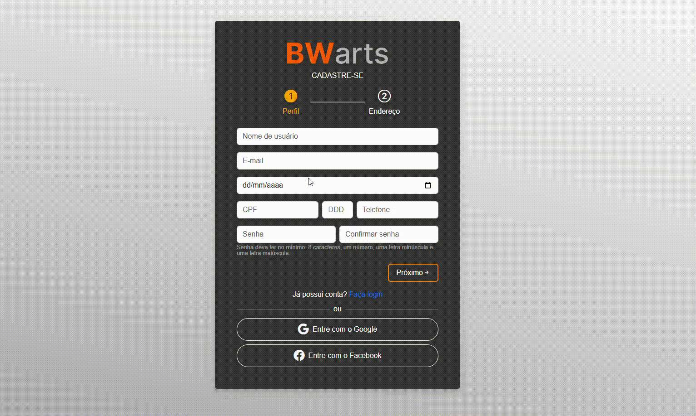
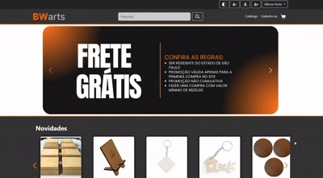

  
  <h1>
    E-commerce de Produtos em MDF
  </h1>

 

Este projeto, desenvolvido por alunos da Fatec Ferraz de Vasconcelos, tem como objetivo atender às necessidades de um microempreendedor que possui uma máquina de corte a laser para MDF e busca ampliar sua receita.

O projeto consiste no desenvolvimento de um e-commerce voltada para a comercialização de produtos em MDF, oferecendo como diferencial um sistema de personalização. Por meio dessa plataforma, os clientes poderão adquirir produtos prontos, personalizar modelos existentes ou criar peças totalmente originais de acordo com sua preferência.

Dessa forma, o projeto agrega valor aos produtos oferecidos, melhora a experiência do cliente e fortalece a presença digital do empreendedor no mercado.

## Índice

- [Demonstrações](#demonstrações)
- [Objetivos](#objetivos)
- [Tecnologias](#tecnologias)
- [Funcionalidades](#funcionalidades)
- [Integrantes](#integrantes)

---

# Demonstrações

  <h2>Perfil usuário e admin</h2>
  </img>

  <h2>Página inicial</h2>
  </img>

# Objetivos

Desenvolver uma plataforma de e-commerce especializada em produtos confeccionados em MDF e permitir que o usuário:

- Compre produtos prontos disponíveis no catálogo;
- Personalize produtos já existentes;
- Crie peças totalmente originais.

O sistema oferece ferramentas de personalização que permite o cliente definir detalhes como design, dimensões, gravações e acabamentos, proporcionando uma experiência de compra única e personalizada.

# Tecnologias

  <kbd margin-right="1">
    <kbd>Front-end</kbd>
     
     
    
  </kbd>
  <kbd>
    <kbd>Back-end</kbd>
     
     
    
  </kbd>
  <kbd>
    <kbd>Ferramentas</kbd>
     
     
    
  </kbd>

# Funcionalidades

- [X] Catálogo de produtos em MDF;
- [X] CRUD de produto;
- [X] CRUD de usuário;
- [ ] Sistema de compra online;
- [ ] Criação de peças personalizadas pelo usuário;

# Integrantes

<table border="0">
<tr>
  <td align="center" width="50%" style="border:none">
    
  
  
  ### Guilherme Brito dos Santos
  
  Desenvolvimento Full-stack • UI Design • Banco de Dados • Documentação
  
  
  &nbsp;&nbsp;&nbsp;&nbsp;
  
    
  </td>

  <td align="center" width="50%" style="border:none">

  
  
  ### Robert Ritchi Alves da Silva
  
  Desenvolvimento Full-Stack • Banco de Dados • Documentação • DevOps
  
  
  &nbsp;&nbsp;&nbsp;&nbsp;
  
  
  </td>
</tr>
</table>
